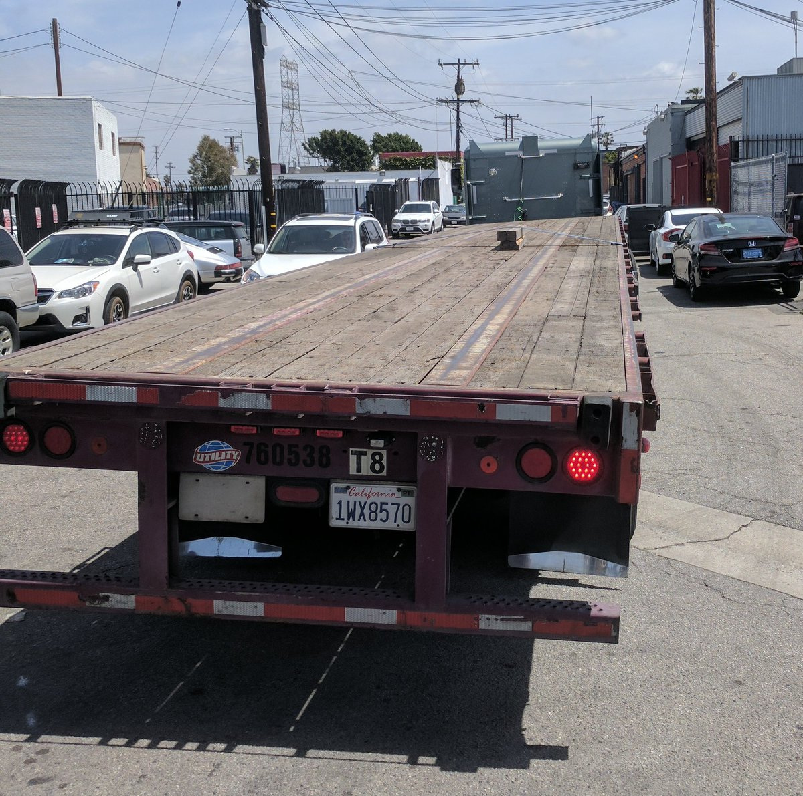

# URL Shortener 
Built on Python3 and deployed in AWS
### Application is managed via [ArgoCD](https://argoproj.github.io/argo-cd/) inside the EKS (kubernetes) cluster

You can use any part of this project as an example for your own projects or infrastructure configuration 

This is a demo project.  
**Don't use kubernetes** for a single app just because "having your application on kubernetes is fancy".. by doing that this is how your app might look like (or how actually this **url-shortener** project looks like on k8s):  

### Manage your AWS resources and your wallet wisely. 

